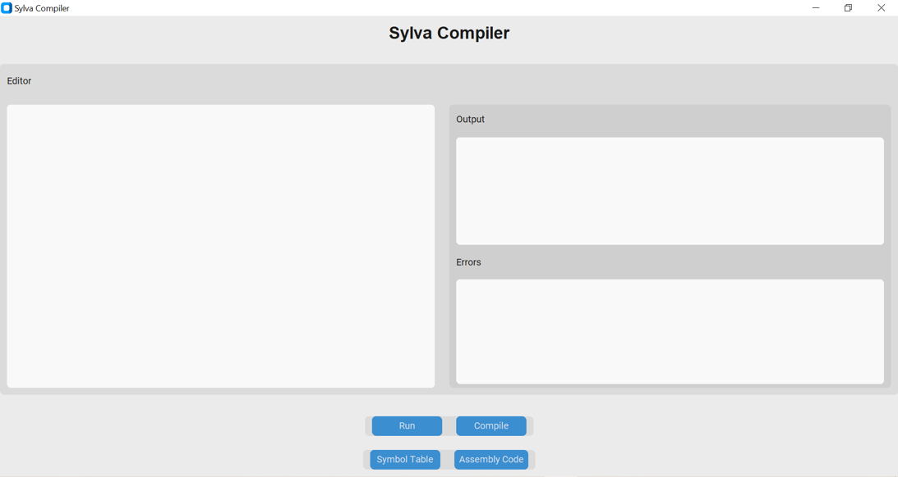
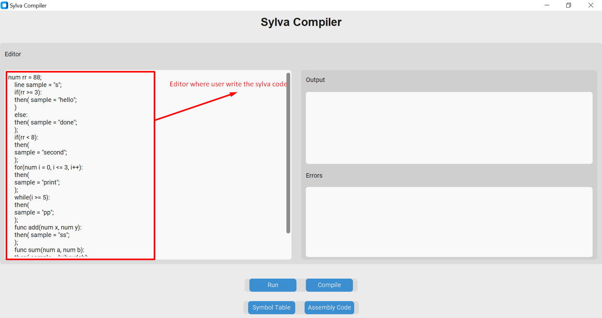
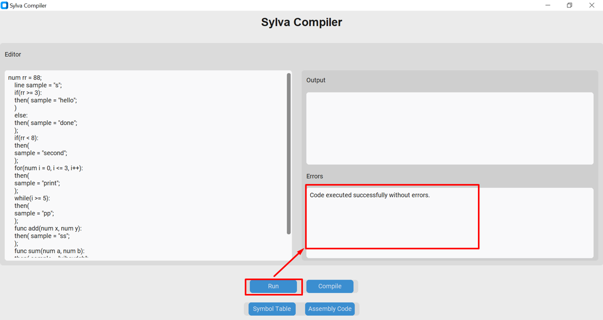
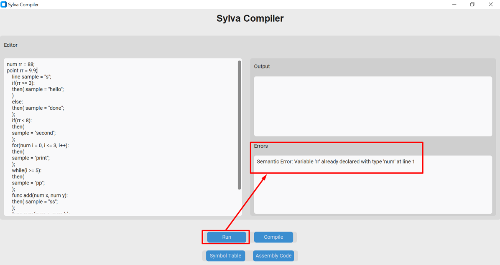
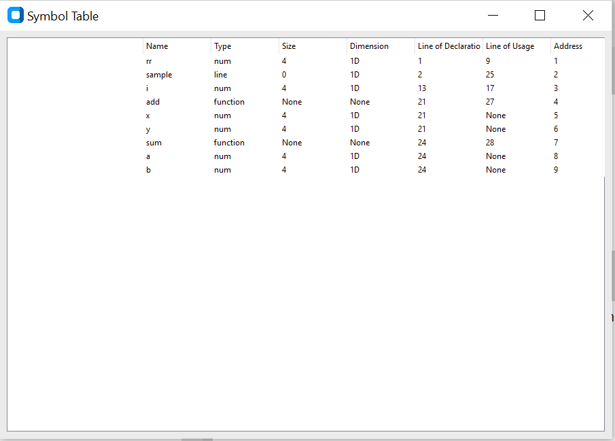
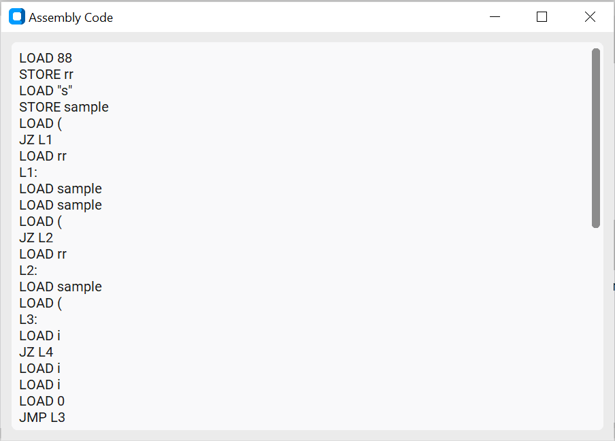

# Sylva
------------------------------------------------------------------------------
## What is Sylva?
``` Welcome to the Sylva Compiler project! A Language compiler made using python. This repository contains a comprehensive compiler implementation for the Sylva programming language, including lexical analysis, syntax analysis, semantic analysis, code generation, and a GUI interface. ```
### DataTypes
1 - num (integer)

2 - point (Float)

3 - line (String)

4 - binal (Boolean)

### Features
1 - Lexical Analysis

2 - Syntax Analysis

3 - Semantic Analysis

4 - Assembly Code Generation

5 - Graphical User Interface (GUI)

-----------------------------------------------------------
### Dependencies and Installation
To install Sylva, please follow these steps:

1- Clone the repository to your local machine.
```python
git clone https://github.com/yourusername/sylva.git
```

2- Install the required dependencies by running the following command:

```python
pip install -r requirements.txt
```

### Usage
To run the Sylva Compiler, execute the following command:

```python
python main.py
```

You can also use the graphical interface by running:
```python
python gui.py
```

### Screenshots







